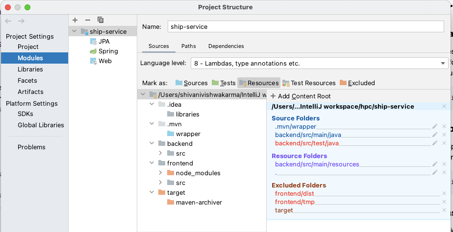

# Ship Manager

This is a fullstack application to demonstrate the CRUD operations using Angular 12.1.1 and Java.
It stores the data in the embedded H2 database. 
The current application version is - 29.07.21


##The application has the following features:

### Login API

  - There are two types of user roles - ADMIN and USER
  - The usernames and passwords are maintained in a DB table "user" 
  - When the user tries to login, validation is perform from the backend
  - On successful validation, a JWT token is generated for the user and passed to the frontend for making authorized requests to the backend API


### Ship API
  
  - Ship List
    - The home page initially displays the list of ships in the table
    - It also provides options for deleting, updating and adding a new ship
    - The table provides the option for searching and existing ship by ship name
    - The table provides the option for sorting the records by any field
    - The table is paginated and also has option to select the number of rows the user wants to display in a page


  - Add Ship - The add ship utility allows the user to add the details of a new ship and update the same in the database
    


  - Edit Ship - The edit ship utility allows the user to edit the details of an existing ship and update the same in the database


  - Delete Ship - The delete ship utility allows the user to delete any ship record


## Getting started with frontend angular application

### Clone the repo

```shell
git clone https://github.com/ShivaniVishwakarma/Ship-Manager-Angular-Java-CRUD
cd frontend
```

### Install npm packages

Install the `npm` packages described in the `package.json` and verify that it works:

```shell
npm install
npm start
```

### npm scripts

These are the most useful commands defined in `package.json`:

* `npm start` - runs the TypeScript compiler, asset copier, and a server at the same time, all three in "watch mode".
* `npm run build` - runs the TypeScript compiler and asset copier once.
* `npm run serve` - runs `lite-server`.

### Development server

Run `npm start` for a dev server. Navigate to `http://localhost:4200/`. The app will automatically reload if you change any of the source files.

### Third Party Libraries used in Frontend

* jquery v3.6.0 - https://jquery.com/
* ngx-toastr v14.0.0 - https://www.npmjs.com/package/ngx-toastr
* primeflex v2.0.0 - https://www.npmjs.com/package/primeflex
* primeicons v4.1.0 - https://www.npmjs.com/package/primeicons
* primeng v11.4.4 - https://www.primefaces.org/primeng/

#### Note - 
    Service Worker has been implemented in frontend. It will help in reducing the application load time for subsequent requests.

## Getting started with backend springboot application

### Build the application

- Set the content root for the source and the resource folder in you IDE to point to backend folder as shown in the below image:
  
  
  
- Trigger build using below command:
```shell 
mvn clean install
```

### Run the application

- Run the springboot application either from the IDE run application or by using any of the below commands:

```shell 
Run Spring Boot app using Maven: mvn spring-boot:run
Run Spring Boot app with java -jar command: java -jar target/ship-service-29.07.21.jar
```

### H2 Database
Once the application is up, you can login to the H2 database from your browserL:
```shell 
H2 Console Url: localhost:8080/h2
JDBC Url: jdbc:h2:~/ship-db
username: sa
password:
```

### SonarQube 
```shell 
http://localhost:9000/
```
### API Details

1. Get all the ship records: GET request
```shell 
localhost:8080/ships/getall
```
2. Get the ship record for a given shipCode: GET request
```shell 
localhost:8080/ships/get/{shipCode}
```
3. Add a new ship record: POST request
```shell 
localhost:8080/ships/add
```
4. Update the ship record for a given shipCode: PUT request
```shell 
localhost:8080/ships/update
```
5. Delete the ship record for a given shipCode: DELETE request
```shell 
localhost:8080/ships/delete/{shipCode}
```
6. Fetch the ship details based on the search title, page number, number of records to be fetched per page and the sorting field and order: GET request
```shell 
localhost:8080/ships/getAllShipsPage?shipName=&page=0&size=10&sort=shipCode,asc
```

### Third Party Libraries used in Backend

* Json Web Token (JWT) - https://jwt.io/introduction
* H2 database - https://www.h2database.com/javadoc/
* Lombok - https://projectlombok.org/

## Few upcoming enhancements

* Server side pagination
* Unit testing for backend
* Few sonar fixes
* Maintaining spring profiles in application.yaml
* Packaging and building angular + springboot application
* Deployment changes - docker
* Documentation


